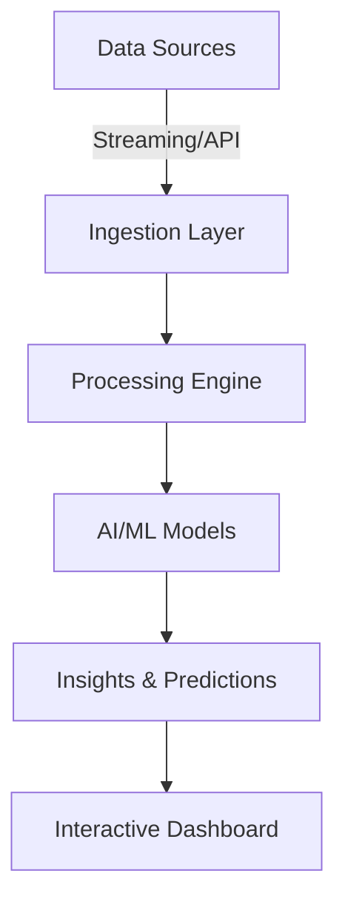

# 🚀 ANVESHA – Redefining Exploration with Intelligence

> ⚡ *“Turning raw data into living insights.”*

Anvesha is a **next-gen intelligent platform** that fuses **AI, data pipelines, and visualization** into one seamless experience. It’s built for speed, scalability, and adaptability – empowering exploration like never before.

---

## 🎯 Features

✅ **Real-time Processing** – Lightning-fast data capture & analysis
✅ **Scalable Architecture** – Modular, microservice-ready design
✅ **AI-Enhanced Insights** – Predictive + prescriptive intelligence
✅ **Interactive Visualizations** – Intuitive dashboards for decision-making
✅ **Plug & Play** – Easily integrates with external APIs & datasets

---

## 🏗️ Tech Stack

* **Frontend:** React.js / Next.js + Tailwind CSS
* **Backend:** Node.js / Express / FastAPI
* **Database:** MongoDB / PostgreSQL
* **AI/ML:** TensorFlow / PyTorch / Scikit-learn
* **Deployment:** Docker, Kubernetes, CI/CD with GitHub Actions
* **Cloud:** AWS / GCP / Azure (flexible infra)

---

## ⚡ Architecture



---

## 🚀 Installation & Usage

```bash
# Clone the repo
git clone https://github.com/your-username/Anvesha.git
cd Anvesha

# Install dependencies
npm install   # or yarn install

# Start development server
npm run dev
```

---

## 📊 Demo Workflow

1️⃣ Data ingested from sensors / APIs / datasets
2️⃣ Preprocessed & cleaned in pipeline
3️⃣ AI models generate insights
4️⃣ Results visualized in dashboards

---

## 🌍 Future Scope

* 🌐 Cross-platform mobile integration
* 🤖 Advanced federated learning support
* 🔐 Zero-trust security framework
* ☁️ Multi-cloud orchestration

---

## 🤝 Contribution

We love contributions ❤️ Fork, branch, PR – and let’s build the future of exploration together!

---

🔥 *Anvesha isn’t just a project – it’s the spark of a smarter tomorrow.*

